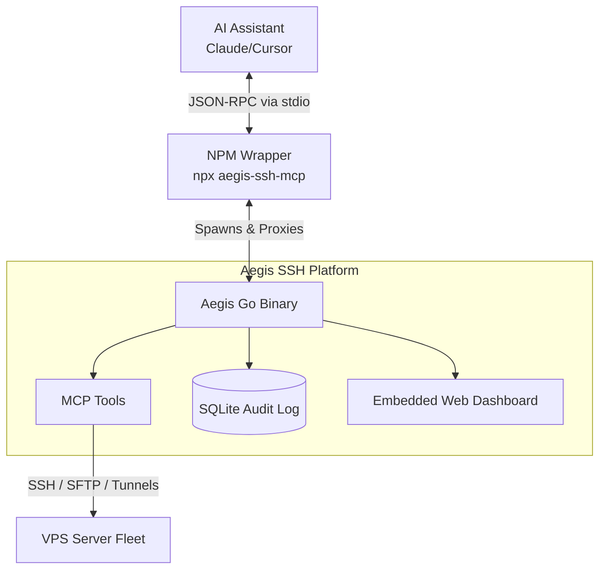

<div align="center">
  
  # 🛡️ Aegis SSH Platform
  
  **Transform your AI Assistant into an Enterprise DevOps Engineer.**  
  *A lightning-fast, zero-dependency MCP (Model Context Protocol) Server for secure SSH fleet orchestration, written in Go.*

  <br />

  [](https://goreportcard.com/report/github.com/LuxVTZ/aegis-ssh)
  [](https://github.com/LuxVTZ/aegis-ssh/blob/main/LICENSE)
  [](https://github.com/LuxVTZ/aegis-ssh/releases)
  [](https://www.npmjs.com/package/aegis-ssh-mcp)

  <br />

  [Installation](#-quick-start) •
  [Key Features](#-key-features) •
  [Architecture](#-architecture) •
  [Dashboard](#-web-dashboard) •
  [Security](#-security)

</div>

---

## ⚡ Why Aegis?
Most MCP servers are clunky Python or Node.js scripts requiring massive dependency trees, virtual environments, and constant troubleshooting. 

**Aegis is different.** It’s compiled into a single, high-performance binary. No `pip`, no `node_modules`. With built-in support for **Reverse Tunneling**, **Playbook Execution**, and a stunning **Linear-style Web Dashboard**, Aegis represents the ultimate bridge between Large Language Models and your raw infrastructure.

---

## 🔥 Key Features

| Feature | Description |
| :--- | :--- |
| 🚀 **Zero-Install (NPM Wrapper)** | Install globally in 2 seconds via `npx aegis-ssh-mcp setup`. |
| 🌐 **Linear-style Dashboard** | Embedded GUI to monitor servers, active tunnels, and audit logs. |
| 🛡️ **Enterprise Security** | Strict Regex Whitelisting/Blacklisting prevents AI hallucinations from running destructive commands. |
| 📜 **AI Playbook Engine** | The AI generates declarative YAML playbooks to configure dozens of servers concurrently. |
| 🚇 **Reverse Tunneling** | Expose local development servers to the public internet securely via SSH (Ngrok alternative). |
| 🐳 **Native Docker Integration** | Native JSON-based Docker inspection tools designed specifically for AI parsing. |

---

## 🚀 Quick Start

Aegis features an interactive CLI wizard that automatically configures your AI agents (Claude Desktop, Cursor).

```bash
# 1. Run the interactive installer wizard
npx -y aegis-ssh-mcp setup

# 2. Restart your AI Client (Claude/Cursor)
```
*The wizard will automatically locate your config files, inject the MCP server, and generate a `.aegis_skills.md` file with optimal system prompts for your AI.*

<details>
<summary><b>🛠️ Manual Installation (Advanced)</b></summary>
<br>

**1. Download the Binary**  
Download the pre-compiled binary for your OS from the [Releases page](https://github.com/LuxVTZ/aegis-ssh/releases) and place it in your PATH.

**2. Configure Claude Desktop**  
Add the following to your `claude_desktop_config.json`:
```json
{
  "mcpServers": {
    "aegis-ssh": {
      "command": "aegis-ssh",
      "args": ["server"]
    }
  }
}
```
</details>

---

## 🖥️ Web Dashboard

Aegis isn't just an invisible backend protocol. It comes with a beautiful, baked-in Web UI to give you complete visibility over what the AI is doing.

```bash
aegis-ssh web --port 8080
```
*Navigate to `http://localhost:8080` to view real-time audit logs, server statuses, and active tunnels in a sleek, dark-mode interface.*

---

## 🏗 Architecture



---

## 🛡️ Security

When granting an AI access to your servers, security is paramount.
1. **Audit Logs:** Every command executed by the AI is logged into a local SQLite database (`~/.sshmcp/audit.db`), viewable via the Dashboard.
2. **Execution Policies:** Configure strict Regex rules to block dangerous commands (e.g., `rm -rf /`).
3. **Idempotency:** The Playbook engine ensures configuration drifts are safely managed.

---

<div align="center">
  <b>Built with ❤️ using Go, Reactivity, and the Model Context Protocol.</b><br>
  <br>
  <a href="https://github.com/LuxVTZ/aegis-ssh/issues">Report Bug</a> · 
  <a href="https://github.com/LuxVTZ/aegis-ssh/pulls">Request Feature</a>
</div>
